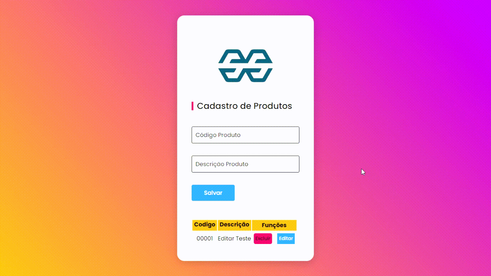
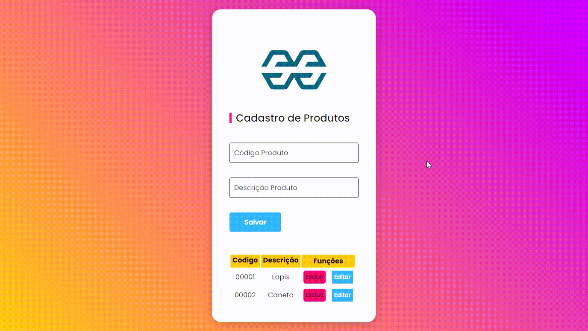
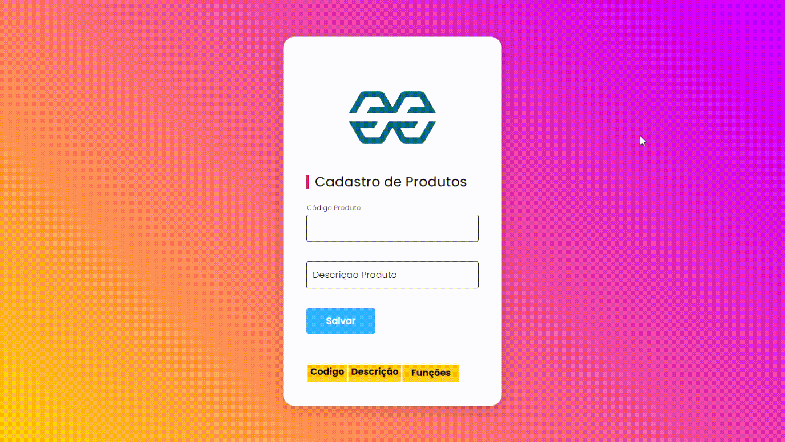

<h1> CRUD JavaScript com LocalStorage</h1>

> Status: Projeto finalizado

 
O projeto tem como finalidade, utilizar os princípios do CRUD, com as informações armazenadas no próprio navegador(LocalStorage).

   
  
<bold>Todos os Direitos Reservados para a empresa <a href="https://www.sodresantoro.com.br/" target="_blank">Sodré Santoro.</a></bold>

    

   

##

### Principais funcionalidades e interface:
 

  + A interface tem o design responsivo e suavizado para uma boa experiência
  + CRUD realizado em tabela
  + Função de criar, ler, editar, e deletar
  + Lógica criada com principios de funções em variáveis
 ## 
 
 
 <h2>Demonstrativo</h2>
  
 
    
 
  

     
  #### - A interface não segue os processos caso os campos não estejam preenchidos, e além disto, os conteúdos estão todos animados, tornando o projeto mais dinâmico.
  ####    
 <h2>Editar</h2>
  
 
    
  

  #### - Clicando no botão Editar, é aberta uma janela no topo da tela para inserir os códigos novos a serem alterados.
  ####

 <h2>Deletar</h2>
  
 
    
  

  
  #### - Ao clicar em excluir, os dados serão deletados, sem que altere a ordem dos de cima ou de baixo.
  ####
  
 <h2>Criar</h2>
  
 
    
  

  
  #### - Para criar, basta os campos estarem preenchidos com seus valores, e então, clicar no botão salvar. Assim, os dados serão introduzidos em valores de tabela.
  ####
  
  #

   
   ### Feito com as seguintes tecnologias:

* [HTML5]()
* [CSS3](https://www.w3.org/Style/CSS/Overview.en.html)
* [JavaScript ES6](https://www.javascript.com/)

(<a href="#top">voltar ao topo</a>)

#
  <h5 align="center">Feito por: Flavio Valle da Cunha.</h5>
  <h6 align="center">Todos os Direitos Reservados à Sodré Santoro Leilões.</h6>
